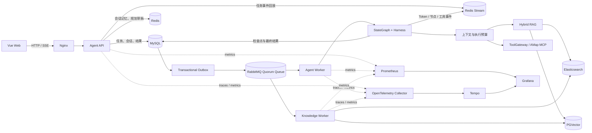

# TravelMind AI

TravelMind AI 是一个面向真实旅行决策场景的智能规划平台。系统将多轮需求理解、候选路线选择、约束求解、知识检索、地图工具调用和行程生成组织为可恢复的声明式工作流，并通过异步任务、流式事件和可观测体系支撑长耗时 Agent 请求。

项目提供 Vue Web 端和统一的 `/api/agent/tasks` 任务入口。用户可以创建相互隔离的会话，补充或修改已有行程，查看实时生成过程、地图路线以及单次运行的节点编排路径。

## 核心能力

- **声明式旅行工作流**：基于 Spring AI Alibaba Graph 构建固定节点和条件路由，覆盖意图识别、约束抽取、候选景点路线、用户澄清、约束求解、地图规划、内容生成、确定性校验和结果持久化。
- **可靠异步执行**：任务和 Outbox 事件在同一 MySQL 事务中落库，由 RabbitMQ Quorum Queue 分发给 Agent Worker，支持发布确认、手动 ACK、分级重试、死信处理、节点检查点和超时任务恢复。
- **实时流式反馈**：模型 Token、节点状态和工具事件写入 Redis Stream，通过 SSE 推送给前端；客户端可使用 `Last-Event-ID` 在断线后续读。
- **会话与记忆隔离**：以 `userId + conversationId` 隔离短期对话和规划草稿，以用户维度保存稳定偏好；任务请求、工作流状态、检查点和最终结果分别按职责持久化。
- **混合知识检索**：Elasticsearch BM25 与 PGVector HNSW 并行召回，使用 RRF 融合结果，并提供索引 Outbox、失败重试、对账修复和蓝绿重建能力。
- **Tool / MCP 治理**：通过统一 ToolGateway 接入高德 MCP，集中执行权限校验、Schema 校验、超时、隔离线程池、缓存、防击穿、限流熔断和调用审计。
- **约束与地图规划**：对景点开放时间、预算、时间窗等硬约束执行求解；使用高德 POI 搜索、详情、周边搜索和驾车/步行/骑行/公交路线能力生成可视化行程。
- **全链路可观测**：Micrometer、OpenTelemetry、Prometheus、Tempo 和 Grafana 覆盖请求、队列、模型、工具、RAG、节点与端到端耗时；Run Explorer 展示单次任务的节点状态及脱敏输入输出。

## 系统架构



### 一次规划请求的处理过程

1. 前端创建会话并向 `POST /api/agent/tasks` 提交请求，同时携带 `Idempotency-Key`。
2. Agent API 校验登录用户和会话归属，在一个事务中写入 `agent_task` 与 Outbox 事件，并立即返回 `taskId`。
3. Outbox Publisher 在 RabbitMQ 发布确认成功后标记事件已发送；Agent Worker 消费任务并获取执行租约。
4. Worker 恢复已有检查点、WorkflowState 和剩余执行预算，进入 StateGraph 的当前节点。
5. 工作流组装当前请求、会话近期消息、结构化规划草稿、用户稳定偏好和已完成节点输出；按节点需要调用混合检索或受治理工具。
6. 若缺少高价值信息，任务进入 `WAITING_USER`；用户补充后通过 resume 接口继续原任务，不清空检查点或重置预算。
7. 生成期间的状态、Token 和工具事件持续写入 Redis Stream，SSE 接口实时转发给浏览器。
8. 最终方案通过确定性校验和新鲜度检查后写入 MySQL，任务进入 `SUCCEEDED`；前端可读取完整结果与运行路径。

## 技术栈

| 领域 | 选型 |
|---|---|
| 后端 | Java 21、Spring Boot 3.4、Spring AI 1.0、Spring AI Alibaba Graph |
| 前端 | Vue 3、Vue Router、Vite、Axios、高德 JS API |
| 模型 | DashScope / Qwen，支持切换 Ollama |
| 工作流 | StateGraph、WorkflowState、Harness、MySQL Checkpoint |
| 数据 | MySQL 8、Redis 7、PGVector、Elasticsearch 8 |
| 消息 | RabbitMQ 4、Quorum Queue、Transactional Outbox |
| 工具 | MCP、Tool Calling、高德地图 MCP、Sentinel、Redisson |
| 可观测 | Micrometer、OpenTelemetry、Prometheus、Tempo、Grafana、Alertmanager |
| 交付 | Docker Compose、Docker、Helm、KEDA、HPA |

## 目录结构

```text
.
├── src/main/java/com/travelmind/aiagent
│   ├── harness/          # StateGraph、工作流节点、检查点执行
│   ├── task/             # 异步任务、Outbox、MQ、SSE、会话
│   ├── knowledge/        # 双索引、知识同步、对账与重建
│   ├── rag/              # 文档处理与向量检索配置
│   ├── tool/             # ToolGateway、策略、审计与治理
│   ├── planning/         # 路线候选、地图规划与约束求解
│   └── observability/    # 指标、Trace、Run Explorer 后端
├── travelmind-ai-frontend/       # Vue 前端
├── travelmind-image-search-mcp-server/ # 图片搜索 MCP 服务
├── solver-service/               # Z3 约束求解服务
├── deploy/                       # Helm 与可观测组件配置
├── benchmark/                    # 负载测试与 RAG 评测工具
└── docker-compose.yml
```

## 快速启动

### 1. 环境要求

- Docker Engine 24+
- Docker Compose v2
- 可用的 DashScope API Key
- 可选：高德开放平台 Web 服务 Key 与 Web 端 JS API Key

### 2. 配置环境变量

复制示例配置：

```bash
cp .env.example .env
```

Windows PowerShell：

```powershell
Copy-Item .env.example .env
```

至少填写以下变量，`.env` 不应提交到仓库：

```dotenv
MYSQL_PASSWORD=your-strong-password
RABBITMQ_PASSWORD=your-strong-password
PGVECTOR_PASSWORD=your-strong-password
DASHSCOPE_API_KEY=your-dashscope-api-key
```

启用高德 MCP 和前端地图时，再填写：

```dotenv
MCP_REMOTE_ENABLED=true
AMAP_MCP_API_KEY=your-amap-web-service-key
VITE_AMAP_JS_API_KEY=your-amap-js-api-key
VITE_AMAP_JS_SECURITY_CODE=your-amap-js-security-code
```

后端 MCP Key 与前端 JS API Key 属于不同类型，请勿混用。

### 3. 启动应用

```bash
docker compose up -d --build
```

启动完成后访问：

- Web 应用：<http://localhost/>
- OpenAPI：<http://localhost/api/swagger-ui.html>
- RabbitMQ 管理台：<http://127.0.0.1:15672/>

管理端口默认只绑定 `127.0.0.1`。部署在远程服务器时，建议使用 SSH 隧道访问，不要直接暴露到公网。

### 4. 启用可观测组件

```bash
docker compose --profile observability up -d --build
```

默认本机入口：

- Grafana：<http://127.0.0.1:3000/>
- Prometheus：<http://127.0.0.1:9091/>
- Alertmanager：<http://127.0.0.1:9093/>
- Run Explorer：`http://localhost/observability/{taskId}`

Grafana 已预置 Agent 平台看板和 Tempo 数据源。生产部署请修改 `GRAFANA_ADMIN_PASSWORD`，并通过内网、VPN 或 SSH 隧道访问管理界面。

### 5. 查看运行状态

```bash
docker compose ps
docker compose logs -f agent-api agent-worker knowledge-worker
```

## 主要接口

所有业务接口都以 `/api` 为上下文路径，登录态由 Redis Session 保存。

| 方法 | 路径 | 作用 |
|---|---|---|
| `POST` | `/api/user/register` | 注册用户 |
| `POST` | `/api/user/login` | 登录并建立 Session |
| `GET` / `POST` | `/api/agent/conversations` | 查询或创建会话 |
| `POST` | `/api/agent/tasks` | 幂等提交 Agent 任务 |
| `GET` | `/api/agent/tasks/{taskId}/events` | 订阅 SSE 流式事件 |
| `GET` | `/api/agent/tasks/{taskId}` | 查询任务、结果和检查点 |
| `POST` | `/api/agent/tasks/{taskId}/resume` | 补充信息并恢复任务 |
| `GET` | `/api/agent/tasks/{taskId}/run` | 查询当前用户可见的运行路径 |
| `GET` | `/api/agent/tasks/{taskId}/run/nodes/{checkpointId}` | 查询节点脱敏输入输出 |
| `POST` | `/api/knowledge/search` | 执行混合知识检索 |

提交任务时必须提供唯一的 `Idempotency-Key` 请求头。相同用户、相同 Key 的重复请求会返回同一个任务，避免网络重试创建重复执行。

## 构建与测试

后端：

```bash
./mvnw test
./mvnw clean package
```

Windows PowerShell：

```powershell
.\mvnw.cmd test
.\mvnw.cmd clean package
```

前端：

```bash
cd travelmind-ai-frontend
npm install
npm run build
```

负载测试、SSE 重连验证和 RAG 消融工具位于 `benchmark/`，默认输出到本地 `target/phase6-reports/`。请在隔离环境运行会创建真实 Agent 任务的场景，避免消耗线上模型与地图 API 配额。
