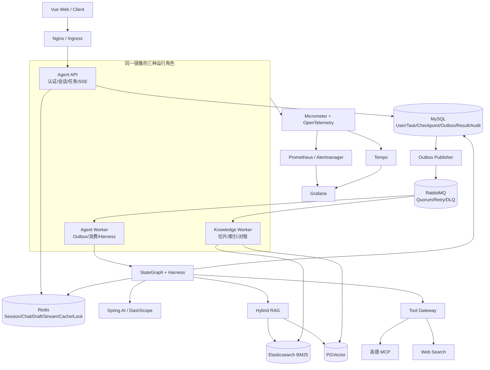
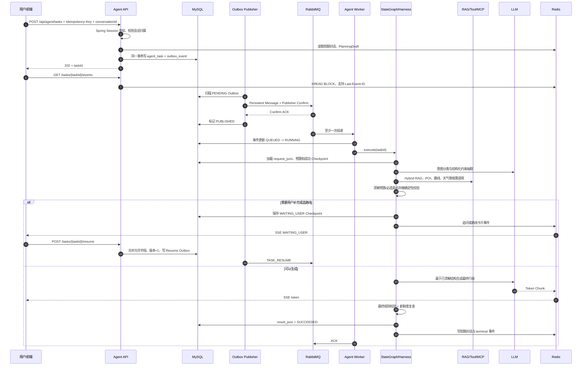

# 01 系统架构与请求链路

## 1. 系统定位

TravelMind 不是同步调用一次 LLM 的聊天应用，而是把大模型放入可靠异步任务系统的旅行决策平台：

1. API 负责认证、会话归属、幂等接入和任务查询；
2. MySQL + Transactional Outbox 负责业务事实和可靠事件；
3. RabbitMQ 驱动 Agent Worker 与 Knowledge Worker；
4. 固定 StateGraph 编排意图、约束、检索、求解、地图、生成与校验；
5. Redis 承担短期对话、PlanningDraft、缓存、锁和可回放进度；
6. Elasticsearch + PGVector 提供混合知识检索；
7. Prometheus、Tempo 和 Run Explorer 分别解决聚合指标、技术 Trace 和业务回放。

核心原则：**LLM 负责理解与表达，固定图负责流程边界，结构化状态负责恢复，确定性组件负责硬约束，Tool/RAG 提供外部事实。**

## 2. 总体架构

## 3. 技术选型与职责

| 层次 | 选型 | 职责与原因 |
|---|---|---|
| 运行时 | Java 21、Spring Boot、模块化单体 | 单仓库保留本地事务边界，同一镜像按运行角色隔离职责，避免过早微服务化 |
| AI | Spring AI、Spring AI Alibaba Graph、DashScope | 统一模型调用与流式接口，使用 StateGraph 声明固定节点和条件边 |
| 异步任务 | RabbitMQ Quorum Queue | 持久消息、手动 ACK、延迟重试与 DLQ；生产多节点能力仍待实测 |
| 可靠发布 | MySQL Transactional Outbox + Publisher Confirm | 解决“数据库已提交、消息尚未发送时进程崩溃”的双写窗口 |
| 任务事实源 | MySQL | 保存任务、预算、Checkpoint、最终结果、Outbox、审计和运行回放 |
| 短期状态 | Redis / Redis Stream / Redisson | Session、短期对话、PlanningDraft、事件回放、缓存和跨实例防击穿 |
| 检索 | Elasticsearch BM25 + PGVector + RRF | 同时覆盖精确词与语义近似，用排名融合避免异构分数直接比较 |
| 工具治理 | Tool Gateway + Sentinel | 统一权限、Schema、超时、隔离、限流熔断、缓存、重试和审计 |
| 地图 | 高德远程 MCP + 前端高德 JS API | 后端获取 POI/路线事实，前端只渲染稳定的 `mapPlan` |
| 推送 | SSE + Redis Stream | 服务端单向推送进度/Token；用 Stream ID 支持 `Last-Event-ID` 续读 |
| 可观测 | Micrometer、Prometheus、OpenTelemetry、Tempo、Grafana | 覆盖 HTTP、MQ、任务、节点、模型、RAG 和 Tool |
| 部署 | Docker Compose；Helm/Kubernetes 配置 | 当前服务器使用 Compose；Chart 提供生产形态但不等于已完成集群实测 |

Kubernetes 环境使用 Service/DNS，不额外引入 Nacos。跨 MQ、ES、PGVector 和外部 API 的一致性使用本地事务、Outbox、幂等和补偿，不使用 Seata 包裹不可控的长事务。

## 4. 一次请求的完整链路

## 5. API 边界

所有路径位于 `/api` context path：

| 方法 | 路径 | 用途 |
|---|---|---|
| POST | `/agent/tasks` | 幂等创建异步任务 |
| GET | `/agent/tasks/{taskId}/status` | 轻量状态轮询，不加载结果和 Checkpoint |
| GET | `/agent/tasks/{taskId}` | 按需查询完整结果和 Checkpoint |
| GET | `/agent/tasks/{taskId}/events` | SSE 在线读取与断线回放 |
| POST | `/agent/tasks/{taskId}/resume` | 补充信息或接受放宽建议后恢复 |
| POST | `/agent/tasks/{taskId}/pause` | 在安全点暂停 |
| POST | `/agent/tasks/{taskId}/cancel` | 请求取消 |
| POST | `/agent/tasks/{taskId}/nodes/{nodeId}/retry` | 重试失败节点 |
| GET | `/agent/tasks/{taskId}/run` | 当前用户查看业务执行路径 |
| GET | `/agent/tasks/{taskId}/run/nodes/{checkpointId}` | 按需查看脱敏节点输入/输出/状态 |
| POST/GET | `/agent/conversations` | 创建和查询当前用户会话 |
| POST | `/knowledge/search` | 混合检索 |
| GET/POST | `/admin/agent/dlq` | 管理员查看/重放 Agent DLQ |

## 6. 可靠性语义

- `request_id` 唯一索引保证 `Idempotency-Key` 重放返回同一任务；
- 任务与 Outbox 在同一个 MySQL 本地事务；
- Outbox 只有收到 Broker Confirm 后才标记发布；
- RabbitMQ 使用至少一次投递，Worker 用 `QUEUED -> RUNNING` 条件更新避免同一任务并发执行；
- 成功完成、安全安排重试或安全进入 DLQ 后才 ACK；无法确认落库时 `NACK + requeue`；
- 节点按任务、逻辑节点、补充版本和 attempt 保存 Checkpoint；
- Worker 中断后由过期任务扫描重新投递，从成功 Checkpoint 重建；
- Redis Stream 故障只影响实时进度，MySQL 仍是状态与最终结果事实源；
- 关键队列使用 Quorum 类型，但当前 Compose 单节点不能宣称 Broker 多节点高可用。

## 7. 存储职责与生命周期

| 数据 | 存储 | 隔离键 | 生命周期 | 事实源 |
|---|---|---|---|---|
| 登录会话 | Redis Spring Session | sessionId | 默认 7 天 | 否 |
| 短期对话 | Redis List | userId + conversationId 哈希 | 50 条、30 天 | 否 |
| PlanningDraft | Redis String | userId + conversationId 哈希 | 30 天/新规划清理 | 否 |
| 显式用户偏好 | MySQL | userId | 业务长期 | 是 |
| 任务请求、状态、预算 | MySQL `agent_task` | taskId | 业务保留期 | 是 |
| 节点状态 | MySQL Checkpoint | taskId + node/version/attempt | 随任务 | 是 |
| SSE 进度与 Token | Redis Stream | taskId | 24 小时、约 1000 条 | 否 |
| 最终行程 | MySQL `result_json` | taskId | 业务保留期 | 是 |
| Tool 热数据 | Redis | 参数哈希 | 策略 TTL | 否 |
| Tool 审计 | MySQL | task/request | 审计周期 | 是 |
| 社区和知识源 | MySQL | sourceId + version | 业务长期 | 是 |
| BM25/向量索引 | ES / PGVector | source/version/chunk | 可重建 | 派生数据 |

## 8. 关键架构决策

| 决策 | 选择 | 没有选择什么 | 复审条件 |
|---|---|---|---|
| 服务拆分 | 模块化单体 + 三运行角色 | 一开始拆大量微服务 | 团队和独立发布边界稳定、单体成为瓶颈 |
| 记忆 | Redis 短期 + MySQL 事实 + 派生向量索引 | 把所有内容塞一个向量库 | 个人长期记忆和隐私治理需求成熟 |
| 消息可靠性 | Outbox + Confirm + 幂等消费 | 只依赖发送重试或分布式事务 | 引入 CDC 平台后可复审 Publisher |
| 检索 | BM25 + PGVector + RRF | 只做向量或直接混合原始分数 | 正式消融证明某一路无价值 |
| 服务发现 | K8s Service/DNS | Nacos | 出现跨集群、非 K8s 注册与配置中心需求 |

## 9. 当前边界

- 当前正式环境使用 Docker Compose，服务器规格和多节点故障数据尚未形成完整记录；
- Helm、HPA、PDB、KEDA 配置代表可部署设计，不代表已完成集群容量验证；
- 模型、地图和检索的外部服务能力仍会限制实际吞吐；
- 性能和 SLA 结论以 [05 压测与评测](05-PERFORMANCE-AND-EVALUATION.md) 为准。
