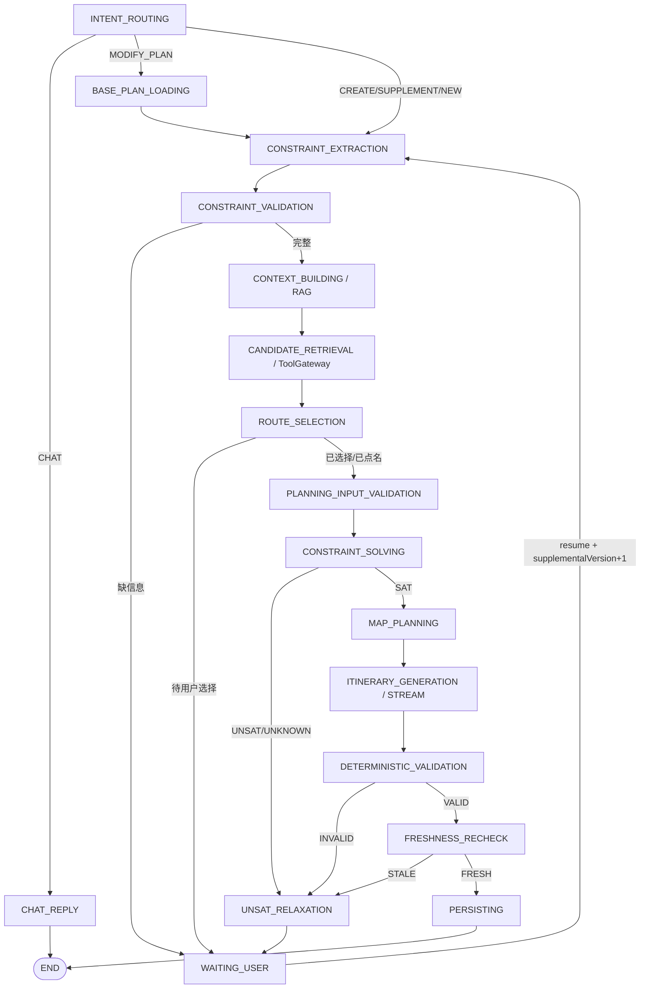
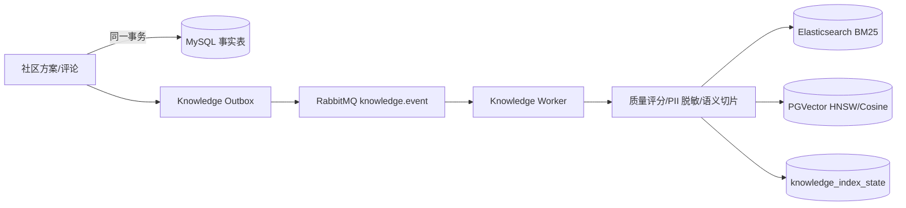

# 02 核心模块实现

## 1. 固定旅行规划 StateGraph

当前系统已经从开放式 ReAct 循环改为固定节点和白名单条件路由。LLM 不决定任意下一跳，也不能生成代码直接执行；它只负责意图分类、自然语言到结构化约束，以及把已验证结构表达为行程文本。



### 1.1 意图路由

意图包括：

- `CHAT`：普通闲聊；
- `CREATE_PLAN`：创建新规划；
- `SUPPLEMENT`：补充上一轮缺失信息或路线选择；
- `MODIFY_PLAN`：基于同会话上一版成功规划修改；
- `NEW_PLAN`：明确开始另一趟旅行，清理旧 PlanningDraft 和恢复数据。

路由输入包含当前消息、最近对话、PlanningDraft 和任务类型，因此“随便制定一下”“把第二天换成博物馆”等省略表达可以继承同会话语境。修改计划不能只依赖被裁剪的聊天文本：前端携带 `baseTaskId`，后端校验用户和会话归属并固化上一版 `result_json` 快照。

### 1.2 结构化约束与求解

核心数据结构：

- `TravelConstraintSpec`：目的地、日期、人数、预算、必选景点、硬约束和软偏好；
- `TravelCandidateSet`：类型化交通、住宿、景点和餐饮候选，包含来源、观测时间和过期时间；
- `TravelSolverResult`：`SAT/UNSAT/UNKNOWN`、入选候选、总成本、UNSAT core 和放宽建议；
- `TravelValidationResult`：在 LLM 外再次检查预算、住宿、必选景点和完整性；
- `FreshnessResult`：最终持久化前检查候选状态与 TTL。

Docker Compose 中可调用独立 Z3 服务；Z3 超时、网络或协议异常时降级到 JVM 有限域求解器。求解失败进入 `WAITING_USER`，用户可以接受最小放宽建议，例如调整预算，任务身份和执行预算不能被 resume 覆盖。

## 2. WorkflowState、Checkpoint 与 Harness

### 2.1 WorkflowState

`WorkflowState` 是本次执行的内存合并视图：

```json
{
  "request": "用户请求、会话快照、偏好、预算和补充版本",
  "data": "约束、知识证据、候选、路线、求解、地图、校验和行程",
  "metrics": "节点耗时等执行数据"
}
```

它不是事实表。事实保存在任务和 Checkpoint 中。

### 2.2 Checkpoint 恢复

每个节点保存 `input_snapshot / output_snapshot / state_snapshot / status / attempt / duration`。恢复步骤：

1. 从最新 `agent_task.request_json` 创建状态；
2. 按节点顺序合并已成功 Checkpoint 的结构化输出；
3. 同一补充版本跳过已成功节点，失败节点进入新 attempt；
4. 用户补充后 `_supplementalVersion + 1`，物理节点 ID 变为 `{node}_vN`，防止复用失效约束和候选；
5. `modelCallsUsed / tokensUsed / nodeExecutionsUsed` 保存在任务表，恢复不重置预算。

### 2.3 Harness 职责

这里的 Harness 是项目内 Agent 执行外壳，不是 Harness.io：

- 节点进入/退出、超时和有限重试；
- 模型调用、估算 Token 和节点执行预算；
- MySQL Checkpoint 和恢复；
- 暂停、取消和安全点；
- Redis Stream 进度/Token 事件；
- 节点指标、Trace 和 Run Explorer 记录。

默认预算为 `maxModelCalls=8`、`maxTokens=12000`、`maxNodeExecutions=32`。固定图消除了无限 Action 循环，超过预算明确以 `BUDGET_EXHAUSTED` 失败。

## 3. 路线选择与地图规划

### 3.1 路线选择门

- 用户只说“去杭州玩”且没有指定景点：RAG/POI 生成多条真实景点组合，LLM 一次批量理解组合并生成动态标题，前端让用户选择；
- 用户已点名“灵隐寺、西湖”：跳过路线选择，逐一精确核验并进入后续规划；
- 模糊目的地如“海比较好看的地方”：先给代表性滨海目的地路线，不把形容词当城市名；
- 用户选择后，完整 `selectedAttractionNames` 写入 `specificAttractions` 硬约束，不能只按一次搜索 ID 过滤。

防止遗漏景点的四道保证：前端提交完整名称、约束层持久化、Candidate Collector 逐名精确搜索、Solver 与 Validator 双重检查。任何必选景点缺失都会进入重选/放宽，而不是静默生成另一条路线。

### 3.2 高德 MCP

后端通过高德托管 Streamable HTTP MCP 接入，API Key 仅由 `AMAP_MCP_API_KEY` 环境变量注入。白名单能力包括地理编码、POI 文本/周边/详情、距离、天气，以及驾车、步行、骑行和公交路线。

调用链：

```text
StateGraph Node
  -> TravelToolFacade
  -> GovernedToolCallback / ToolGateway
  -> RemoteMcpClientManager
  -> 高德 MCP
  -> 类型化候选或 mapPlan
```

`CANDIDATE_RETRIEVAL` 获取候选并按区域聚合；求解成功后 `MAP_PLANNING` 只对入选 POI 获取详情和相邻站点分段路线。结果收敛为 `mapPlan.days[].stops/legs`，Checkpoint 和最终结果保存稳定结构。前端不直连 MCP，而是使用独立 Web JS API Key 渲染 Marker、顺序、路线和 MCP 实际返回的安全图片 URL。

MCP 默认关闭；生产启用必须配置 HTTPS、Token、工具白名单和 Schema 版本。初始化失败且 `required=false` 时降级为文本规划。高德限流使用独立 `USER_MAP_TOOL_QPS`，不会与普通工具共享较低配额。

## 4. 记忆与上下文

### 4.1 当前记忆分层

| 类型 | 实现 | 作用 |
|---|---|---|
| 短期对话 | Redis List，50 条/30 天 | 意图和指代理解 |
| 规划草稿 | Redis String，30 天 | 保存已确认目的地、日期、预算等槽位 |
| 显式用户偏好 | MySQL | 跨会话共享用户主动保存的节奏、饮食、交通等偏好 |
| 执行记忆 | MySQL task/checkpoint | 恢复、审计、预算和节点事实 |
| 流式事件 | Redis Stream，24 小时/约 1000 条 | 在线 SSE 和断线续读 |
| 最终结果 | MySQL result_json | 长期查询和业务事实 |
| 公共知识 | MySQL + ES + PGVector | 可追溯、可重建的外部知识 |

用户之间通过 `userId` 隔离，同一用户不同会话通过 `conversationId` 隔离。不同会话只共享公共知识和显式白名单偏好，不共享原始对话或 PlanningDraft。

### 4.2 上下文装配

```text
System Policy
+ 当前用户输入
+ Redis 最近对话窗口快照
+ PlanningDraft 已确认槽位
+ 显式用户偏好
+ 恢复的结构化 Checkpoint
+ TopK RAG 证据
+ 裁剪后的类型化 Tool 结果
+ 上一版计划（仅 MODIFY）
```

创建任务时把会话窗口和 PlanningDraft 快照写入 `request_json`，Worker 不依赖执行期间隐式变化的 Redis 内容。助手生成的文本不能直接成为用户硬约束。

### 4.3 当前压缩能力与边界

已实现：50 条有界窗口、RAG TopK、Tool 字段化/脱敏/裁剪、上一版计划最多 3000 字符、最终生成只接收结构简报、单任务预算。

未实现：模型 tokenizer 精确分区预算、滚动摘要、摘要版本、线上硬约束保持率、MySQL 全量 Chat History、自动用户画像和个人长期向量记忆。简历只能写“有界窗口与结构化裁剪”，不能写“生产级自动上下文压缩”。

## 5. Redis Stream 与 SSE

- Stream Key：`agent:task:{taskId}:events`；
- 每个节点进度或 Token Chunk 是独立 Record，具有 `毫秒时间戳-序号` ID；
- 在线和重连都使用 `XREAD`，重连从 `Last-Event-ID` 之后读取；
- SSE 只承担服务端单向推送，用户补充信息仍走 HTTP `/resume`；
- Stream 有 TTL 和长度上限，不保存最终事实；
- 最终 `result_json` 保存在 MySQL，避免事件裁剪或 Redis 淘汰造成业务结果丢失。

## 6. RAG 与知识闭环

### 6.1 写入链路



- 幂等键：`sourceType + sourceId + contentVersion`；
- 旧版本事件不能覆盖新版本；
- 删除使用 Tombstone；
- 定时对账缺失、失败和版本落后数据；
- ES 新索引构建完成后 Alias 原子切换；
- MySQL 是事实源，ES/PGVector 均可重建。

### 6.2 查询链路

1. ES/BM25 召回地名、专有名词和精确约束；
2. PGVector 召回语义近似内容；
3. 任一路失败时单路降级并返回 warning；
4. RRF 使用 `1/(k+rank)` 融合排名，不直接比较异构原始分数；
5. 最多加入 20% 质量权重并按内容 Hash 去重；
6. 返回 TopK 和 `sourceType/sourceId/contentVersion/chunkId` 引用；
7. Redis 按请求哈希缓存，默认 5 分钟。

性能不能脱离质量。正式评测需要固定索引与数据集，同时记录 Recall@K、MRR、NDCG、无答案准确率、引用正确率和 P95。

## 7. Tool Gateway 与高并发治理

```text
Harness / ChatClient
  -> Tool Gateway
     -> 节点权限、风险等级、Schema/URL 校验
     -> Redis fresh/stale 缓存
     -> Redisson 参数级防击穿
     -> 有界隔离线程池
     -> Sentinel 用户 QPS、Tool/Model 并发、熔断
     -> 连接/读取/Future 总超时
     -> 仅幂等调用有限重试
     -> 脱敏、裁剪、统一 ToolResult
     -> MySQL 审计
```

标准错误包括 `TOOL_FORBIDDEN`、`TOOL_INVALID_ARGUMENT`、`TOOL_TIMEOUT`、`TOOL_OVERLOADED`、`TOOL_RATE_LIMITED` 和 `TOOL_UPSTREAM_ERROR`。实时调用失败时可以返回 stale 缓存并标记 `degraded=true`。Redis 故障时跳过缓存/互斥，由线程池和 Sentinel 继续保护主链路。

生产不注册通用 Shell/FileSystem Tool；高风险工具需要全局开关、管理员角色和请求级批准。URL 校验拒绝本机、私网和链路本地地址。远程 MCP 工具使用服务名前缀并登记 Schema Hash，版本不变但 Schema 漂移时拒绝注册。

## 8. 已实现与未实现

已实现：固定 StateGraph、意图/修改路由、版本化 Checkpoint、执行预算、路线选择门、确定性求解与校验、Redis 短期记忆、PlanningDraft、Hybrid RAG、知识闭环、Tool/MCP 治理、高德地图结果、SSE 流式返回。

仍需继续：精确 Token Context Envelope、滚动摘要、长期个人语义记忆、RAG Reranker/在线反馈、完整隐私导出与跨存储删除、真实库存/价格二次确认能力。
