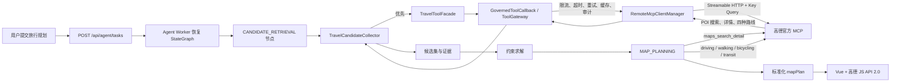

# 高德地图 MCP 接入

## 接入结论

项目通过高德官方托管的 Streamable HTTP 端点 `https://mcp.amap.com/mcp` 接入，不需要在应用容器内安装 Node.js。当前 Spring AI 1.0.0 原先传递依赖的 MCP Java SDK 0.10.0 只有旧 SSE，因此项目将 MCP SDK 最小升级到 0.11.3，并在既有 `RemoteMcpClientManager` 中同时保留 SSE 与 Streamable HTTP 两种传输。

高德 Key 不写入 YAML、数据库或镜像，而是通过 `AMAP_MCP_API_KEY` 环境变量注入。客户端运行时才把 Key 追加到 `/mcp?key=...`，异常日志也会对 Key 脱敏。

## 当前工具与 MCP 清单

实际进入 `TravelToolFacade`、可通过 ToolGateway 调用的能力如下：

| 类型 | 工具 | 状态 |
|---|---|---|
| 本地 Tool | `searchWeb` | 保留；通用网页搜索，高德不覆盖 |
| 本地高风险 Tool | `scrapeWebPage`、`downloadResource` | 仅非生产环境且显式开启时注册，高德不覆盖 |
| 高德远程 MCP | `maps_geo`、`maps_regeocode`、`maps_ip_location`、`maps_text_search`、`maps_around_search`、`maps_search_detail`、`maps_direction_driving`、`maps_direction_walking`、`maps_bicycling`、`maps_direction_transit_integrated`、`maps_distance`、`maps_weather` | 统一增加 `amap_` 前缀并进入 ToolGateway |

仓库还保留独立的 `travelmind-image-search-mcp-server`，提供 `searchImage`，因为高德 MCP 不提供通用图片搜索。它目前属于本地 STDIO 示例服务，不在生产 Agent Worker 的远程 MCP 调用链中。

已删除的重复能力包括：本地 `WeatherTool`、`POISearchTool`、`RoutePlanningTool`，以及 `mcp-servers.json` 中 `@amap/amap-maps-mcp-server` 和 `mcp-server-amap` 两套旧高德 STDIO 配置。

## 完整调用链



Agent Worker 启动阶段，客户端先完成 MCP `initialize` 握手和 `tools/list`；Docker Compose 中 API 与 Knowledge Worker 会显式关闭 MCP，避免无意义地建立重复连接。只有白名单内的工具会注册，工具名增加 `amap_` 前缀，例如服务端 `maps_text_search` 在应用内为 `amap_maps_text_search`，以避免多个 MCP 服务重名。输入 Schema 会登记到 `mcp_tool_schema`，之后所有调用仍经过项目已有的权限校验、Sentinel 并发治理、Redis 缓存/防击穿、超时重试和 MySQL 审计。

固定工作流不会把全部地图工具无条件执行。`CANDIDATE_RETRIEVAL` 先用 `amap_maps_text_search` 获取酒店、景点和餐饮候选，并以首个有效景点为锚点调用 `amap_maps_around_search`，减少跨城区往返。MCP 原始返回会被解析成独立 POI 候选，不再整体塞入 `rawEvidence`。

约束求解成功后进入可恢复的 `MAP_PLANNING` 节点。该节点只对最终入选 POI 调用 `amap_maps_search_detail`，补全坐标、地址、类型和服务端实际提供的 `photos`；随后根据用户交通偏好，在驾车、步行、骑行和公交四个路线工具中选择一个，为同一天的相邻站点逐段算路。结果被收敛为稳定的 `mapPlan.days[].stops/legs`，写入 checkpoint 和最终 `agent_task.result_json`。高德 MCP 不可用、POI 没有坐标或路线没有折线时，任务降级为文本方案或点位直线，不因地图增强失败而丢失整个行程。

前端不连接 MCP。Vue 页面用独立的高德 JavaScript API Key 渲染 `mapPlan`：按天显示带顺序编号的 Marker、路线折线、首张可用 POI 图片，并提供高德 URI 唤端链接。用户切换交通方式时会提交“修改上一版计划”的新任务，由 Agent Worker 重新计算路线并产生新版本结果，从而继续受幂等、限流、缓存、审计和 checkpoint 管理。

## 配置

仓库默认配置位于 `src/main/resources/application.yml`：

```yaml
travel:
  mcp:
    remote:
      enabled: ${MCP_REMOTE_ENABLED:false}
      servers:
        amap:
          transport: STREAMABLE_HTTP
          url: https://mcp.amap.com
          endpoint: /mcp
          auth-query-parameter: key
          token: ${AMAP_MCP_API_KEY:}
```

默认保持关闭，避免开发机没有 Key 时启动访问外网。工具白名单也在同一配置块中，不能由远端服务自行扩大权限。

## 你需要操作的内容

1. 在高德开放平台创建应用并申请一个“Web 服务”Key，供后端 MCP 使用；再申请一个“Web 端（JS API）”Key 和对应安全密钥，供前端地图渲染。不要复用两个 Key，也不要把 Key 提交到 Git。
2. 复制 `.env.example` 为部署使用的 `.env`，至少填写：

   ```dotenv
   MCP_REMOTE_ENABLED=true
   AMAP_MCP_API_KEY=你的高德Key
   AMAP_MCP_REQUIRED=false
   VITE_AMAP_JS_API_KEY=你的高德Web端Key
   VITE_AMAP_JS_SECURITY_CODE=你的JS安全密钥
   ```

   `AMAP_MCP_REQUIRED=false` 表示高德临时不可用时应用仍能启动，并降级为不带地图的文本规划；只有希望“高德 MCP 不可用就禁止 Agent Worker 上线”时才改成 `true`。

3. 在高德控制台给 Web 端 Key 配置实际访问域名白名单。本地 Vite 开发时可在 `travelmind-ai-frontend/.env.local` 写入同名的两个 `VITE_` 变量；Docker Compose 会从根目录 `.env` 将它们作为前端构建参数注入。

4. Docker Compose 部署时重新构建并启动应用：

   ```bash
   docker compose up -d --build agent-api agent-worker
   ```

5. 检查 Agent Worker 日志，成功标志为：

   ```text
   Remote MCP connected: server=amap, version=..., allowedTools=...
   ```

6. 发起包含目的地的 `/api/agent/tasks` 请求。任务执行后，可在 `tool_audit_log` 中检查文本搜索、周边搜索、详情和路线工具；最终 `resultJson.mapPlan.available=true` 时，聊天消息下方会出现地图。

旧的 `AMAP_API_KEY` 与 `QWEATHER_API_KEY` 已不再使用。生产后端维护 `AMAP_MCP_API_KEY`，前端构建额外使用 `VITE_AMAP_JS_API_KEY` 和 `VITE_AMAP_JS_SECURITY_CODE`。

## 图片返回策略

高德底层 POI 详情接口支持 `photos`，但远程 MCP 的实际输出以启动时发现的工具 Schema 和服务端版本为准。项目只展示 MCP 实际返回的 `http/https` 图片地址，每个 POI 最多保留三张、界面默认展示第一张；没有图片时不调用不受治理的第三方抓图接口，也不会阻断地图或行程生成。若部署环境实测 `maps_search_detail` 始终不暴露 `photos`，再通过 ToolGateway 增加高德 POI Web API 详情兜底，而不是把 Web 服务 Key 放到浏览器。

## 安全与可用性说明

- Key 只存在于进程环境变量和发往高德的 HTTPS Query 中；应用不会输出包含 Key 的完整端点。
- 远程工具必须同时通过本地白名单和 ToolGateway 权限校验。
- MCP 初始化失败且 `required=false` 时只降级远程工具，不影响 Agent Worker 启动。
- 高德 MCP 返回的内容属于外部证据，仍需经过结果长度限制、缓存、审计和后续行程校验，不能直接改变工作流路由或执行预算。
