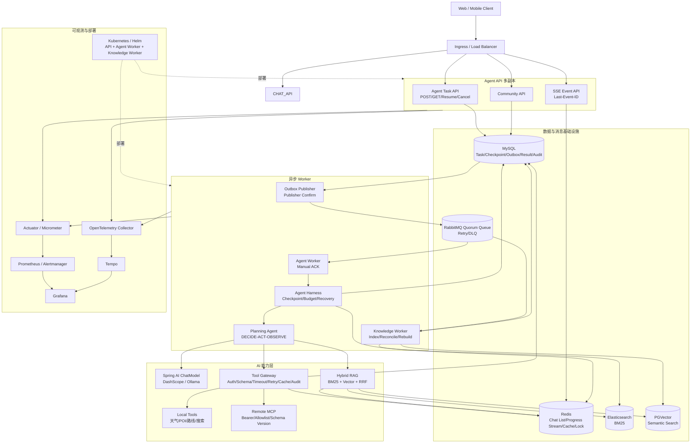
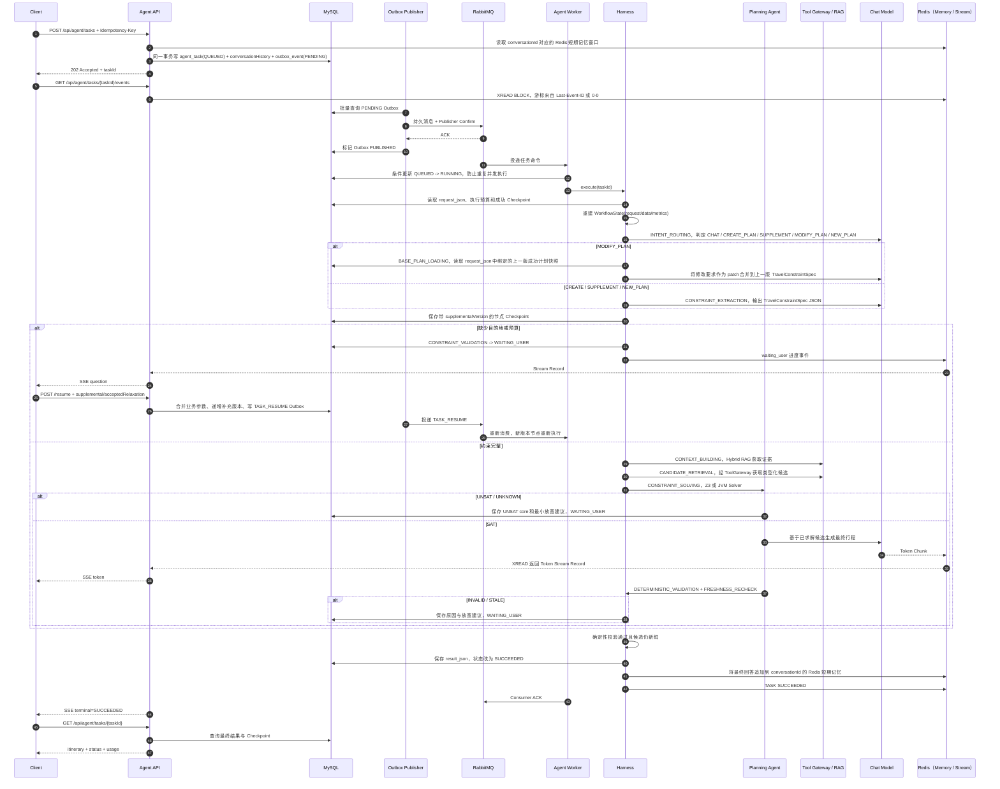
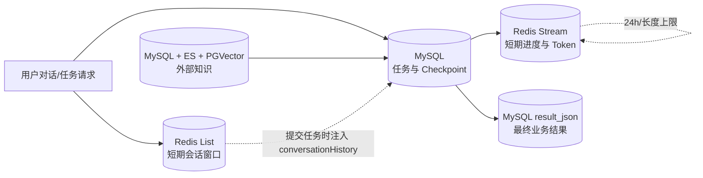

# 当前平台架构、请求链路、记忆与上下文管理

## 1. 文档边界

本文描述当前仓库已经落地的架构，而不是最终规划稿。平台统一使用 `/api/agent/tasks` 作为 AI 入口：所有咨询与规划先创建异步任务，再通过任务 SSE 接收进度、追问和 Token，通过 `resume` 补充信息。旧 `/api/ai/**` 已删除，不提供兼容转发，前端也不再调用。

当前尚未上线完整 Chat History、滚动摘要、用户画像和向量长期记忆；这些能力不能当作已经实现。

## 2. 总体架构与技术选型



### 2.1 选型说明

| 层次 | 当前选型 | 主要职责与选择原因 |
|---|---|---|
| 应用运行时 | Java 21、Spring Boot、模块化单体 | 保留单仓库事务边界，通过运行角色拆成 API、Agent Worker、Knowledge Worker，降低过早微服务化成本 |
| AI 编程模型 | Spring AI ChatClient/ChatModel/Advisor | 统一模型、流式输出、记忆、RAG 和 Tool Calling 接口 |
| 模型 | DashScope；Ollama 作为本地选项 | 云模型承担主要推理，本地模型便于开发和降级验证 |
| 异步任务 | RabbitMQ Quorum Queue | 关键队列具备复制能力；配合手动 ACK、延迟重试和 DLQ 管理任务交付 |
| 可靠发布 | MySQL Transactional Outbox + Publisher Confirm | 在一个本地事务内保存任务与待发事件，解决“任务入库但消息未发出”的双写问题 |
| 任务事实源 | MySQL | 保存任务状态、执行预算、Checkpoint、最终结果、Outbox 和工具审计，适合事务与查询 |
| 短期记忆/事件 | Redis List + Redis Stream | List 保存有界聊天窗口；Stream 保存可回放的临时进度和 Token 事件 |
| 缓存与并发 | Redis + Redisson | RAG/Tool 缓存、短期降级结果和分布式防击穿锁 |
| 关键词检索 | Elasticsearch BM25 | 支持倒排、过滤、版本化索引和横向扩展 |
| 语义检索 | PGVector | 与 Spring AI VectorStore 集成，保存向量和元数据过滤字段 |
| 融合检索 | Reciprocal Rank Fusion | 不要求不同召回器分数同尺度，先融合 ES 与 PGVector 排名 |
| 工具治理 | Tool Gateway + Sentinel | 统一权限、Schema、隔离线程池、超时、幂等重试、缓存、限流熔断和审计 |
| 推送 | SSE | 旅行规划是服务端单向进度/Token 推送，不需要 WebSocket 的双向协议复杂度 |
| 部署 | Docker Compose；生产形态为 Kubernetes/Helm | 本地一键启动，生产将同一镜像按角色扩缩容 |
| 可观测 | Actuator、Micrometer、OpenTelemetry、Prometheus、Grafana、Tempo | 关联 HTTP、MQ、Agent 节点、模型、RAG 与工具耗时 |

当前 Kubernetes 形态使用 Service/DNS，不额外引入 Nacos；跨模型、MQ、ES、PGVector 的长事务采用 Outbox、幂等和补偿，不使用 Seata 包裹。

## 3. 一个异步旅行规划请求如何完整处理



### 3.1 可靠性与失败处理

- `Idempotency-Key` 映射到 `request_id` 唯一索引，重复提交返回同一任务；
- 任务与 Outbox 在同一 MySQL 事务，消息只在 Broker Confirm 后标记已发布；
- Quorum Queue 保存关键任务，消费者成功完成或安全落库后手动 ACK；
- 节点以 `taskId + nodeId + attempt` 保存输入、输出和状态快照；
- Worker 中断后由过期任务扫描重新投递，从成功 Checkpoint 重建状态；
- 可重试消息进入 10 秒/60 秒延迟队列，耗尽后进入 DLQ；
- Redis Stream 失败只影响实时进度，不回滚 MySQL 中的任务执行；
- 最终结果必须保存在 MySQL，不能只存在模型上下文或 Redis 临时事件中。

## 4. 记忆如何管理

这里的“记忆”不是一种存储，而是按用途和生命周期拆分的四类数据。



### 4.1 短期会话记忆

- 实现：`RedisChatMemory` + `AgentConversationMemoryService`；
- Key：`agent:chat:memory:{sha256(conversationId)}`，不直接暴露原始会话 ID；
- 数据结构：Redis List；每条元素是 JSON，保留 USER、ASSISTANT、SYSTEM、TOOL 消息以及 Tool Call/Response；
- 写入：Lua 脚本原子执行 `RPUSH + LTRIM + PEXPIRE`；
- 窗口：默认最多 50 条消息；
- TTL：默认 30 天；
- 注入：创建任务时读取当前窗口，写入 `request_json.conversationHistory`，Planning Agent 随任务状态读取；
- 更新：提交和 `resume` 时追加用户消息，任务成功后追加最终回答；
- 清理：`DELETE /api/agent/tasks/conversations/{conversationId}/memory`；
- 降级：Redis 记忆不可用时使用空历史继续创建任务，不破坏任务事实链路。

Redis ChatMemory 是可共享的短期窗口，不是完整审计历史，也不是最终行程事实源。

### 4.2 Agent 执行记忆

异步任务把可恢复状态保存在 MySQL：

- `agent_task.request_json`：原始请求、业务约束和首次创建的执行预算；
- `agent_workflow_checkpoint.input_snapshot`：节点输入；
- `output_snapshot`：结构化约束、知识证据、候选集、求解结果、校验结果或最终生成结果；
- `state_snapshot`：当时的 `request + data + metrics`；
- `model_calls_used/tokens_used/node_executions_used`：已消耗预算；
- `result_json`：最终稳定查询结果。

恢复时从最新 `request_json` 创建 `WorkflowState`，再按顺序合并所有成功 Checkpoint 的输出。物理节点 ID 含 `_supplementalVersion`：同一版本恢复跳过成功节点，用户补充条件后执行新版本节点，避免复用已经失效的约束或候选。

### 4.3 进度事件记忆

- Key：`agent:task:{taskId}:events`；
- 数据结构：Redis Stream，每条进度或 Token Chunk 有独立 Stream Record ID；
- 保留：默认近似裁剪到 1000 条，TTL 24 小时；
- 读取：在线和断线重连都通过 `XREAD`；重连时使用浏览器传来的 `Last-Event-ID`；
- 定位：只承担实时传输和短期回放，终态仍以 MySQL 为准。

### 4.4 外部知识记忆

- MySQL 保存社区方案、评论、知识源版本和索引状态；
- Knowledge Outbox/RabbitMQ 驱动增量索引、删除、对账与重建；
- Elasticsearch 承担 BM25 关键词召回；
- PGVector 承担语义召回；本地可用 SimpleVectorStore，生产配置使用 PGVector；
- `KnowledgeHybridSearchService` 使用 RRF 融合两路排名，通过 Redis 缓存查询结果，默认 TTL 5 分钟；
- 固定图的 `CONTEXT_BUILDING` 节点按目的地与必选标签检索证据；候选数据由后续求解器消费，知识文本只作为解释和最终表述材料。

### 4.5 当前未实现的记忆能力

以下仍属于后续改造，当前简历和架构说明不能写成已完成：

- MySQL 全量 Chat History；
- 会话滚动摘要；
- 用户画像和结构化长期偏好；
- PGVector 长期语义记忆；
- 自动遗忘、用户数据导出和跨存储隐私删除编排。

## 5. 上下文如何管理

### 5.1 统一任务入口的会话上下文

任务提交时按以下顺序形成初始上下文：

```text
System Policy
  + Redis ChatMemory 最近窗口快照 conversationHistory
  + 当前用户 prompt 与 TravelConstraintSpec
  + 已恢复的结构化 Checkpoint
  + 类型化 Tool 候选与 TopK RAG 证据
```

`conversationId` 负责隔离 Redis 短期窗口。ChatMemory 不直接成为模型的隐藏状态，而是在创建任务时生成显式快照，随后跟随任务 Checkpoint 一起恢复。该链路已有消息数窗口，但没有生产级精确 Token 预算、滚动摘要和长期记忆召回。

### 5.2 `/api/agent/tasks` 规划上下文

异步 Planning Agent 使用 `WorkflowState`：

```json
{
  "request": "任务请求、硬约束、软偏好、执行预算",
  "data": "constraintSpec、knowledgeEvidence、candidateSet、solverResult、validationResult、itinerary",
  "metrics": "各节点耗时"
}
```

处理规则：

1. 首次执行从 `agent_task.request_json` 建立 request；
2. 恢复时合并成功 Checkpoint 输出，不清空已有状态；
3. StateGraph 条件边只读取 `CONTINUE / SAT / UNSAT / VALID / FRESH / WAITING` 等白名单路由；
4. `WAITING_USER` 恢复只修改允许的旅行参数，不能覆盖任务身份或执行预算；
5. `maxModelCalls`、`maxTokens`、`maxNodeExecutions` 限制成本，固定图自身消除了无限 Action 循环；
6. Tool Gateway 对外部结果脱敏、裁剪和缓存，RAG 默认只取 TopK 证据；
7. 最终生成读取已求解的结构化状态并流式输出，确定性校验通过后才保存完整结果。

约束抽取 Prompt 和最终生成 Prompt 都把检索/工具结果标记为不可信事实材料，禁止其覆盖系统约束；真正的工具执行仍经过权限与 Schema 校验，模型文本不会被当作代码执行。

### 5.3 当前上下文压缩边界

统一任务入口使用以下粗粒度边界控制增长：跨任务会话窗口最多 50 条消息，单任务使用模型调用预算、类型化候选、Tool 结果裁剪和 RAG TopK。当前尚未实现真正的 Token-aware Context Envelope；最终生成仍会读取 `WorkflowState.snapshot()`，候选和证据规模增长时仍需进一步压缩。

下一阶段建议按以下优先级落地，文档当前只将其记录为计划：

1. 固定保留 System Policy、当前请求、日期/预算/人数等硬约束；
2. 使用模型对应 tokenizer 预估输入并为输出预留 Token；
3. 对重复 RAG Chunk 和 Tool JSON 去重，只保留引用及关键字段；
4. 超过阈值时生成带版本的滚动摘要，原始消息继续保存在 Chat History；
5. 按 `近期对话 > 硬约束 > Tool/RAG 证据 > 摘要 > 低价值历史` 的优先级装配；
6. 记录各上下文分区 Token、被裁剪原因和硬约束保持率。

## 6. 存储职责与生命周期

| 数据 | 存储 | 生命周期 | 是否事实源 |
|---|---|---|---|
| 短期聊天窗口 | Redis List | 默认 30 天、最多 50 条 | 否 |
| 任务请求/状态/预算 | MySQL `agent_task` | 业务保留周期 | 是 |
| 节点决策与输出 | MySQL Checkpoint | 随任务保留 | 是 |
| SSE 进度与 Token | Redis Stream | 24 小时、约 1000 条 | 否 |
| 最终行程 | MySQL `result_json` | 业务保留周期 | 是 |
| Tool 热数据/降级副本 | Redis | 按工具策略 TTL | 否 |
| Tool 审计 | MySQL | 审计保留周期 | 是 |
| 社区与知识源 | MySQL | 业务保留周期 | 是 |
| 关键词索引 | Elasticsearch | 可由 MySQL 重建 | 派生数据 |
| 语义索引 | PGVector | 可由 MySQL 重建 | 派生数据 |

## 7. 当前结论

当前项目已经形成“可靠异步任务外壳 + 可恢复 Planning Agent + 按需 Tool/RAG + SSE 流式事件 + MySQL 最终事实源”的主链路。记忆目前完成了 Redis 短期会话窗口、MySQL 执行状态和外部知识记忆三类能力；完整历史、滚动摘要、用户画像和精确 Token 上下文压缩仍应作为下一阶段工作。
