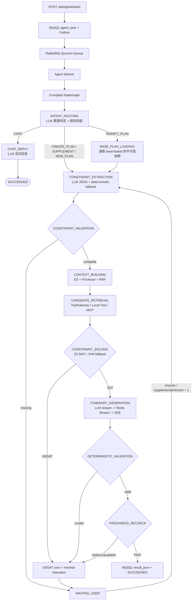

# 正式旅行规划 StateGraph

## 目标

业务路由由固定图决定，LLM 只承担受约束的意图分类、自然语言到结构化约束、以及已验证计划到自然语言行程。预算、候选选择、可满足性、校验和新鲜度均由代码或 SMT 求解器决定，系统不会执行模型生成的代码。

## 完整链路



## 意图路由（闲聊 / 创建 / 补充 / 修改 / 新一轮）

`INTENT_ROUTING` 是图的入口节点，用一次 LLM 结构化调用把输入分成五类：

- `CHAT`：问候、寒暄、致谢、身份或能力提问等与出行无关的输入，直接经 `CHAT_REPLY` 流式回复并结束任务，
  不再向用户索要目的地。回复文本写入 `result_json.itinerary` 并用 `responseType=CHAT` 标记，前端无需改动。
- `CREATE_PLAN`：没有上一版计划时创建新行程。
- `SUPPLEMENT`：任务处于 `WAITING_USER` 时回答系统追问，使用 `/resume` 继续同一个任务。
- `MODIFY_PLAN`：基于上一条成功计划做局部增删改。固定路由先进入 `BASE_PLAN_LOADING`，加载上一版
  `constraintSpec / solverResult / itinerary`，再把本次要求作为 patch 合并，重新检索、求解和校验；未点名部分在生成阶段尽量保持不变。
- `NEW_PLAN`：用户明确改主意或要求另起一段行程。引擎在该分支丢弃由旧检查点恢复出来的行程状态，
  并移除 `baseTaskId / basePlanSnapshot`，避免旧行程污染新一轮规划。

上下文与可靠性约束：

- 只拼接 `conversationHistory` 最近 6 轮、每轮裁剪 180 字，避免历史长行程挤占提示词预算；
- 上下文与用户输入一律声明为不可信材料，模型只允许返回 `{"intent","confidence","reason"}` 三字段 JSON；
- 模型不可用、超时或输出不可解析时按关键词规则兜底（重新开始 → `NEW_PLAN`，存在基线且引用某一天或增删改 → `MODIFY_PLAN`，
  旅行关键词 → `CREATE_PLAN`，问候闲聊 → `CHAT`，等待补充期间的短输入 → `SUPPLEMENT`），规则结论带 `intentSource=HEURISTIC` 便于排障；
- 空输入不调用模型，直接交给 `CONSTRAINT_VALIDATION` 追问，保持零模型消耗；
- 客户端显式声明的 `taskType` 优先于模型判定：`QA` 直接走闲聊分支，`MODIFY` 必然进入基线加载分支。

`baseTaskId` 由前端绑定到用户当前看到的成功计划；未传时，后端按同一 `conversationId` 自动查找最近成功的 `PLAN/MODIFY` 任务。
后端校验任务状态、会话和用户归属，并在新任务的 `request_json.basePlanSnapshot` 中保存不可变快照，避免只依赖 Redis 中被裁剪的对话文本。

## 数据缺口不等于约束不可满足

`CANDIDATE_RETRIEVAL` 依赖高德等外部工具。工具失败或没有返回数据时，求解器按估算候选降级出解，
并把缺口写入 `solverResult.diagnostics.dataGaps`（例如 `hotel_availability`）；只有「确有候选但违反硬约束」
才进入 UNSAT core。相应地 `FRESHNESS_RECHECK` 只把「曾确认过可用性」的候选失去可用性判为过期，
估算候选的不可用作为已知降级放行，最终行程会被要求显式声明哪些实时数据不可用。

## 状态与检查点

- `OverAllState` 只保存图路由键 `route / lastNode / taskId`；
- 业务状态仍由 `WorkflowState` 保存为 `request / data / metrics`，避免把框架内存当事实源；
- 每个图节点通过 Harness 执行，统一获得 MySQL checkpoint、超时、重试、取消安全点、模型/Token/节点预算和 Redis Stream 事件；
- 物理节点 ID 为 `{logicalNode}_v{supplementalVersion}`。同一版本恢复会跳过成功节点，新版本会重新抽取约束和求解；
- `NEW_PLAN` 意图在同一版本内清空恢复出来的旧行程数据并重置请求视图，避免旧检查点结果被新一轮规划复用；
- `MODIFY_PLAN` 的最终结果使用 `responseType=MODIFY` 并记录 `baseTaskId`，形成可追踪的版本链；
- 最终 `result_json` 同时保存 `responseType / itinerary / constraintSpec / solverResult / validationResult / freshnessResult / metrics`，
  闲聊分支只有 `responseType=CHAT` 与 `itinerary`（回复文本）有值。

## 求解器部署

- 默认 `travel.solver.z3.enabled=false`，使用 JVM 有限域求解器，适合本地开发和降级；
- Docker Compose 默认启动 `solver-service` 并令 Agent Worker 通过 `http://solver-service:8091` 调用 Z3；
- Z3 服务使用命名约束生成 UNSAT core，并对 SAT 结果最小化总成本；
- Z3 超时、网络异常或协议异常时自动降级，诊断字段记录 `FINITE_DOMAIN_JAVA_FALLBACK`，不会直接让任务丢失。

## WAITING_USER 闭环

缺少目的地/预算、求解 UNSAT、确定性校验失败或候选过期都会进入 `WAITING_USER`。客户端可提交普通补充字段，也可提交：

```json
{
  "supplemental": {
    "acceptedRelaxation": {
      "budget": 6500
    }
  }
}
```

服务端会展开 `acceptedRelaxation`、追加 `supplementalHistory`、递增 `_supplementalVersion`，通过 Transactional Outbox 发布 `TASK_RESUME`。任务身份和执行预算不可修改。
