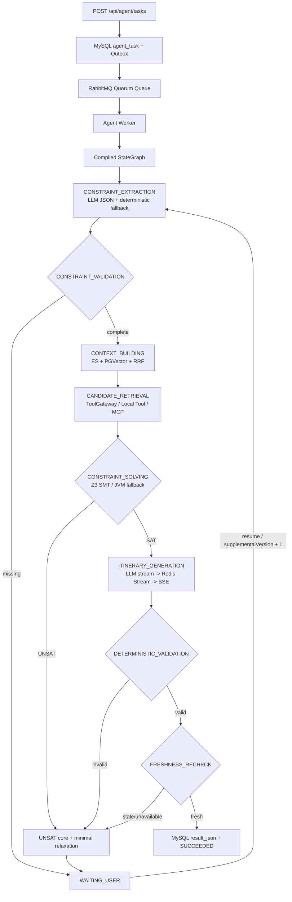

# 正式旅行规划 StateGraph

## 目标

业务路由由固定图决定，LLM 只承担“自然语言到结构化约束”和“已验证计划到自然语言行程”两个非确定性步骤。预算、候选选择、可满足性、校验和新鲜度均由代码或 SMT 求解器决定，系统不会执行模型生成的代码。

## 完整链路



## 状态与检查点

- `OverAllState` 只保存图路由键 `route / lastNode / taskId`；
- 业务状态仍由 `WorkflowState` 保存为 `request / data / metrics`，避免把框架内存当事实源；
- 每个图节点通过 Harness 执行，统一获得 MySQL checkpoint、超时、重试、取消安全点、模型/Token/节点预算和 Redis Stream 事件；
- 物理节点 ID 为 `{logicalNode}_v{supplementalVersion}`。同一版本恢复会跳过成功节点，新版本会重新抽取约束和求解；
- 最终 `result_json` 同时保存 `itinerary / constraintSpec / solverResult / validationResult / freshnessResult / metrics`。

## 求解器部署

- 默认 `travel.solver.z3.enabled=false`，使用 JVM 有限域求解器，适合本地开发和降级；
- Docker Compose 默认启动 `solver-service` 并令 Agent Worker 通过 `http://solver-service:8091` 调用 Z3；
- Z3 服务使用命名约束生成 UNSAT core，并对 SAT 结果最小化总成本；
- Z3 超时、网络异常或协议异常时自动降级，诊断字段记录 `FINITE_DOMAIN_JAVA_FALLBACK`，不会直接让任务丢失。

## WAITING_USER 闭环

缺少目的地/预算、求解 UNSAT、确定性校验失败或候选过期都会进入 `WAITING_USER`。客户端可提交普通补充字段，也可提交：

```json
{
  "supplemental": {
    "acceptedRelaxation": {
      "budget": 6500
    }
  }
}
```

服务端会展开 `acceptedRelaxation`、追加 `supplementalHistory`、递增 `_supplementalVersion`，通过 Transactional Outbox 发布 `TASK_RESUME`。任务身份和执行预算不可修改。
