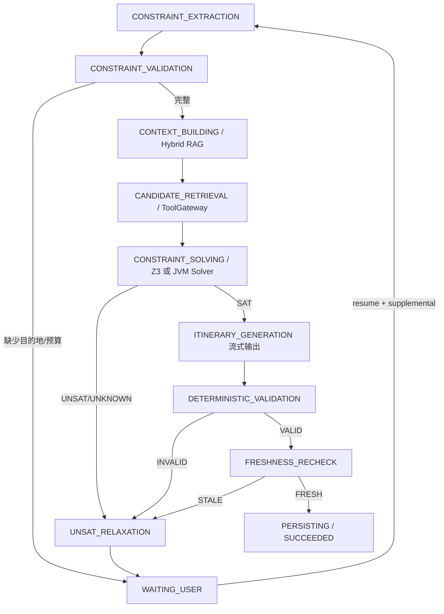

# Phase 2：异步任务与 Agent Harness

## 请求链路

```text
POST /agent/tasks + Idempotency-Key
  -> MySQL 本地事务
       -> agent_task(QUEUED)
       -> outbox_event(PENDING)
  -> Outbox Publisher + Publisher Confirm
  -> RabbitMQ agent.plan.q (Quorum Queue)
  -> Worker 原子抢占 QUEUED -> RUNNING
  -> ExplicitTravelWorkflowEngine
       -> 节点前后写 agent_workflow_checkpoint
       -> Redis Streams 追加进度
       -> 成功写 result_json / 失败写 error_code
  -> Consumer 手动 ACK
```

HTTP 提交只创建任务并返回 `202 + taskId`，不等待天气、POI、RAG 或模型调用。

## 可恢复的正式旅行规划工作流 v3



`TravelPlanningGraphFactory` 使用 Spring AI Alibaba `StateGraph / OverAllState / CompiledGraph` 声明固定节点和条件边。LLM 不再决定下一跳：它只把自然语言抽取为白名单 `TravelConstraintSpec`，以及把已经通过求解和校验的结构化方案表述为行程文本。候选 POI、住宿、餐厅、路线和知识证据在对应固定节点内按约束需要调用，所有外部调用仍经过 ToolGateway 或 Hybrid RAG。

节点按照 `task_id + logical_node + supplemental_version + attempt` 写 MySQL 检查点。用户恢复任务时只合并旅行约束/偏好，执行预算、任务身份和幂等字段不可修改；补充版本递增后重新抽取约束并重跑受影响节点，不重置模型调用、Token 或节点执行计数。`acceptedRelaxation` 可携带系统给出的最小放宽参数。

## 可靠性语义

- `request_id` 唯一索引保证提交幂等；
- 任务创建和 Outbox 事件在同一 MySQL 事务；
- Publisher Confirm 成功后才把 Outbox 标为已发布；
- Worker 使用 `QUEUED -> RUNNING` 条件更新抢占，重复消息不会重复并发执行；
- 每个固定图节点都以 `(task_id, node_id, attempt)` 保存检查点；`node_id` 含补充版本，防止恢复后误用旧约束；
- Worker 超过 300 秒没有更新任务，由恢复扫描重新写 Outbox 命令；
- 可重试失败进入 10 秒、60 秒延迟队列，不可重试或耗尽重试进入 DLQ；
- DLQ 查询和重放接口仅允许管理员调用；
- MySQL 是任务最终状态事实源，Redis Streams 故障不会回滚任务。

## 预算与停止条件

请求可设置 `maxModelCalls`（默认 8）、`maxTokens`（默认 12000）和 `maxNodeExecutions`（默认 32）。这些执行预算在任务创建时冻结，恢复请求不能覆盖；节点还声明超时和最大重试次数。`maxAgentSteps` 为 v2 兼容字段，v3 固定图不再用它驱动动态 Action 循环。超过预算会以 `BUDGET_EXHAUSTED` 明确失败，取消和暂停在节点安全点生效。

## API

在 `server.servlet.context-path=/api` 下：

| 方法 | 路径 | 用途 |
|---|---|---|
| POST | `/api/agent/tasks` | 提交任务，必须传 `Idempotency-Key` |
| GET | `/api/agent/tasks/{taskId}` | 查询状态、结果和检查点 |
| GET | `/api/agent/tasks/{taskId}/events` | SSE；支持 `Last-Event-ID` 回放 |
| POST | `/api/agent/tasks/{taskId}/pause` | 请求暂停 |
| POST | `/api/agent/tasks/{taskId}/resume` | 合并补充参数并恢复 |
| POST | `/api/agent/tasks/{taskId}/cancel` | 请求取消 |
| POST | `/api/agent/tasks/{taskId}/nodes/{nodeId}/retry` | 重试失败节点 |
| GET | `/api/admin/agent/dlq` | 查看 DLQ 消息数 |
| POST | `/api/admin/agent/dlq/replay` | 确认发布后重放 DLQ |

提交示例：

```json
{
  "conversationId": "travel-2026-001",
  "taskType": "PLAN",
  "prompt": "规划上海三日亲子游",
  "destination": "上海",
  "startDate": "2026-10-01",
  "days": 3,
  "budget": 6000,
  "travelers": 3,
  "travelType": "亲子游",
  "maxModelCalls": 8,
  "maxTokens": 12000,
  "maxNodeExecutions": 32,
  "maxAgentSteps": 8
}
```

## 约束求解与工具边界

正式规划状态只允许在预定义节点之间流转：

- `TravelConstraintSpec`：硬约束、软偏好、预算、人数、日期和必选类别；
- `TravelCandidateSet`：类型化交通、住宿、景点和餐厅候选，包含来源、观测时间与过期时间；
- `TravelSolverResult`：`SAT / UNSAT / UNKNOWN`、选择结果、总成本、UNSAT core 与放宽建议；
- `TravelValidationResult`：在 LLM 之外重新检查预算、住宿、必选类别和方案完整性；
- `FreshnessResult`：最终持久化前检查候选可用状态和 TTL。

`Z3TravelConstraintSolver` 在配置开启时调用独立 Z3/SMT 服务，超时或不可用时降级到 `DeterministicTravelConstraintSolver`。任何模型文本都不会作为 Python/Java 代码执行。工具权限、Schema、超时、缓存、重试、熔断和审计仍由 ToolGateway 统一治理。

## 当前验证边界

- 自动化测试覆盖 StateGraph 的 SAT/UNSAT 条件路由、约束抽取、确定性求解、WAITING_USER、检查点 JSON 往返、提交幂等和 RabbitMQ 队列参数；
- `src/test/resources/evaluation/travel-planner-constraints.jsonl` 提供预算、住宿可用性、人数和必选类别回归集；
- 已使用 JDK 21 运行正式规划相关定向测试；
- MySQL Flyway 容器测试已包含 Phase 2 三张表，但当前 Docker daemon 未启动，MySQL/RabbitMQ/Redis 整链路容器测试尚未实际运行；
- 正式声称“故障恢复成功率、吞吐量、P95”前，仍需在 Phase 6 执行容器故障演练与压测。
