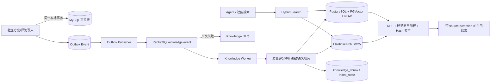

# Phase 3：检索与知识闭环

## 数据与索引链路

MySQL 是唯一事实源。ES 和 PGVector 都是可丢弃、可重建的派生索引；社区事务不直接调用外部索引，避免索引故障拖垮主业务。

## 一致性语义

- 方案与评论变更同时递增 `knowledge_version`，并在同一 MySQL 事务写入 Outbox。
- 消费端使用 `sourceType + sourceId + contentVersion` 幂等；旧版本消息不会覆盖新版本。
- 删除使用 Tombstone，同时清理 ES 与 PGVector，并保留 MySQL 索引状态用于审计。
- 每 15 分钟检查缺失、失败或版本落后的源，并重新进入 Outbox/MQ 流水线。
- 管理端提供数量/状态对账、DLQ 查询与重放、全量重建；ES 在新索引构建完成后原子切换 Alias。

## 检索路径

1. Elasticsearch 对标题、正文、标签、城市和区域执行 BM25，并支持城市、区域、旅行类型和有效期过滤。
2. PGVector 使用独立 PostgreSQL 数据源和 HNSW/Cosine 执行语义召回。
3. 两路召回互不依赖；单路失败时返回降级结果和 warning。
4. 使用 RRF 融合排名，再做最多 20% 的质量轻加权及内容 Hash 去重。
5. 每个结果携带 `sourceType/sourceId/contentVersion/chunkId`，Agent 可以输出可追溯引用。

## 运维接口

- `POST /api/knowledge/search`：混合检索。
- `GET /api/knowledge/admin/reconcile`：数量与失败状态对账。
- `POST /api/knowledge/admin/rebuild`：蓝绿全量重建。
- `GET /api/knowledge/admin/dlq`：知识索引死信状态。
- `POST /api/knowledge/admin/dlq/replay?limit=10`：人工重放死信。

管理接口均要求管理员角色。评测集位于 `src/test/resources/evaluation/travel-rag-eval.jsonl`，当前包含 100 条，覆盖明确目的地、模糊意图、多约束、时效、别名口语、无答案和对抗错误前提。真实 Recall@K、MRR、NDCG、引用正确率和 P95 必须在中间件与标注语料就绪后运行并留存原始结果；不得用单元测试数据冒充线上指标。
