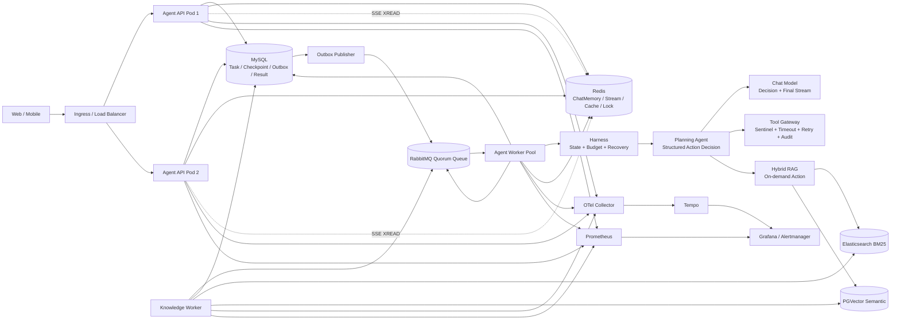
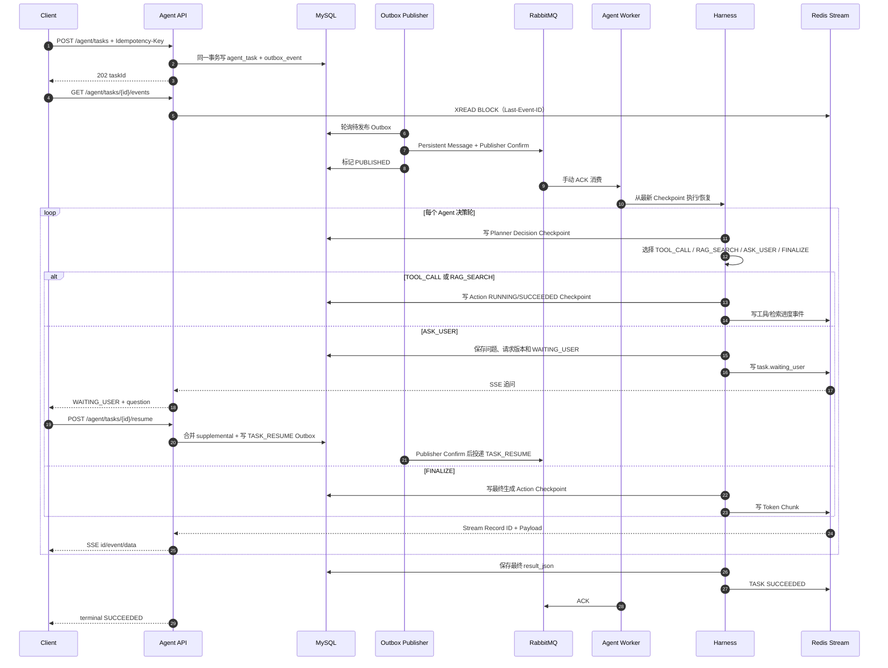
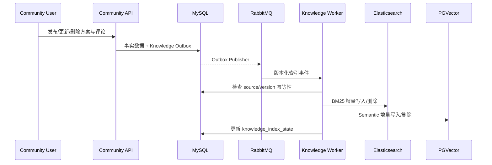

# Phase 6：当前架构图与关键时序

## 部署与数据流

```mermaid
flowchart LR
    U[Web / Mobile] --> ING[Ingress / Load Balancer]
    ING --> API1[Agent API Pod 1]
    ING --> API2[Agent API Pod 2]

    API1 --> MYSQL[(MySQL\nTask / Checkpoint / Outbox / Result)]
    API2 --> MYSQL
    API1 --> REDIS[(Redis\nChatMemory / Stream / Cache / Lock)]
    API2 --> REDIS

    AW[Agent Worker Pool] --> MYSQL
    AW --> RMQ[(RabbitMQ Quorum Queue)]
    MYSQL --> OP[Outbox Publisher]
    OP --> RMQ
    RMQ --> AW
    AW --> HARNESS[Harness\nState + Budget + Recovery]
    HARNESS --> PLANNER[Planning Agent\nStructured Action Decision]
    PLANNER --> LLM[Chat Model\nDecision + Final Stream]
    PLANNER --> TG[Tool Gateway\nSentinel + Timeout + Retry + Audit]
    PLANNER --> RAG[Hybrid RAG\nOn-demand Action]
    AW --> REDIS

    KW[Knowledge Worker] --> RMQ
    KW --> MYSQL
    KW --> ES[(Elasticsearch BM25)]
    KW --> PG[(PGVector Semantic)]
    RAG --> ES
    RAG --> PG

    API1 -. SSE XREAD .-> REDIS
    API2 -. SSE XREAD .-> REDIS

    API1 --> OTEL[OTel Collector]
    API2 --> OTEL
    AW --> OTEL
    KW --> OTEL
    OTEL --> TEMPO[Tempo]
    API1 --> PROM[Prometheus]
    API2 --> PROM
    AW --> PROM
    KW --> PROM
    PROM --> GRAFANA[Grafana / Alertmanager]
    TEMPO --> GRAFANA
```

## 异步规划与流式返回

```mermaid
sequenceDiagram
    autonumber
    participant C as Client
    participant A as Agent API
    participant M as MySQL
    participant O as Outbox Publisher
    participant Q as RabbitMQ
    participant W as Agent Worker
    participant H as Harness
    participant R as Redis Stream

    C->>A: POST /agent/tasks + Idempotency-Key
    A->>M: 同一事务写 agent_task + outbox_event
    A-->>C: 202 taskId
    C->>A: GET /agent/tasks/{id}/events
    A->>R: XREAD BLOCK（Last-Event-ID）
    O->>M: 轮询待发布 Outbox
    O->>Q: Persistent Message + Publisher Confirm
    O->>M: 标记 PUBLISHED
    Q->>W: 手动 ACK 消费
    W->>H: 从最新 Checkpoint 执行/恢复
    loop 每个 Agent 决策轮
        H->>M: 写 Planner Decision Checkpoint
        H->>H: 选择 TOOL_CALL / RAG_SEARCH / ASK_USER / FINALIZE
        alt TOOL_CALL 或 RAG_SEARCH
            H->>M: 写 Action RUNNING/SUCCEEDED Checkpoint
            H->>R: 写工具/检索进度事件
        else ASK_USER
            H->>M: 保存问题、请求版本和 WAITING_USER
            H->>R: 写 task.waiting_user
            R-->>A: SSE 追问
            A-->>C: WAITING_USER + question
            C->>A: POST /agent/tasks/{id}/resume
            A->>M: 合并 supplemental + 写 TASK_RESUME Outbox
            O->>Q: Publisher Confirm 后投递 TASK_RESUME
        else FINALIZE
            H->>M: 写最终生成 Action Checkpoint
            H->>R: 写 Token Chunk
        end
        R-->>A: Stream Record ID + Payload
        A-->>C: SSE id/event/data
    end
    H->>M: 保存最终 result_json
    H->>R: TASK SUCCEEDED
    W->>Q: ACK
    A-->>C: terminal SUCCEEDED
```

## 知识闭环

```mermaid
sequenceDiagram
    participant U as Community User
    participant API as Community API
    participant DB as MySQL
    participant MQ as RabbitMQ
    participant KW as Knowledge Worker
    participant ES as Elasticsearch
    participant PG as PGVector

    U->>API: 发布/更新/删除方案与评论
    API->>DB: 事实数据 + Knowledge Outbox
    DB-->>MQ: Outbox Publisher
    MQ->>KW: 版本化索引事件
    KW->>DB: 检查 source/version 幂等性
    KW->>ES: BM25 增量写入/删除
    KW->>PG: Semantic 增量写入/删除
    KW->>DB: 更新 knowledge_index_state
```
