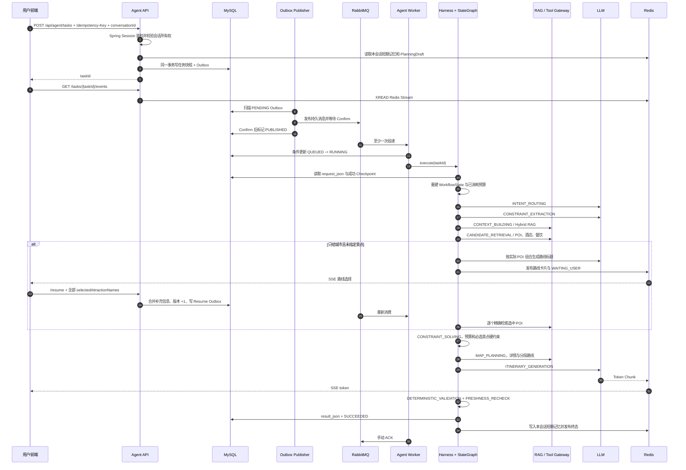

# Agent 旅行决策平台总复习

## 1. 先记住系统的核心定位

这个项目不是“调用一次 LLM 返回一段文字”，而是四层系统叠加：

1. 可靠异步任务层：任务、Outbox、RabbitMQ、重试、DLQ、幂等；
2. Agent 编排层：StateGraph、WorkflowState、Checkpoint、执行预算、暂停恢复；
3. AI 能力层：意图识别、约束抽取、RAG、Tool/MCP、求解器、生成与校验；
4. 平台治理层：用户/会话隔离、缓存限流、指标、Trace、Run Explorer、部署发布。

一句话设计原则：**LLM 负责理解和表达，固定图负责流程边界，结构化状态负责恢复，确定性组件负责关键约束，外部系统事实由 Tool/RAG 提供。**

## 2. 一条消息进来后的完整链路



### 2.1 API 入口做什么

- Spring Session 从 Redis 恢复登录态；
- 当前用户只能操作自己的 `conversationId` 和 `taskId`；
- `Idempotency-Key` 写入 `request_id` 唯一索引，重复提交返回原任务；
- 创建任务时把最近会话窗口、PlanningDraft、显式用户偏好固化进 `request_json`；
- `agent_task` 和 `outbox_event` 在同一个 MySQL 事务提交，API 不同步等待 LLM。

### 2.2 为什么还需要 Outbox

Publisher Confirm 只能证明 RabbitMQ 是否收到一次发送，不能解决“数据库已提交，应用在发送前崩溃”。Outbox 把“将来必须发送的消息”先与任务一起提交，后台发布器反复扫描，只有 Broker Confirm 后才标记成功。因此系统采用至少一次投递，并用任务状态条件更新、事件 ID 和业务唯一键完成幂等。

### 2.3 Worker 如何消费

- RabbitMQ 投递 `PLAN_CREATE / PLAN_MODIFY / TASK_RESUME`；
- Worker 先用条件更新抢占任务，重复消息无法并发执行同一任务；
- 业务可重试错误进入 10 秒、60 秒重试队列，超过次数进入 DLQ；
- 无法判断是否安全落库的基础设施异常使用 `basicNack(requeue=true)`；
- 成功、已安全安排重试或已安全进入 DLQ 后才手动 ACK。

## 3. Workflow、WorkflowState 和 Checkpoint

### 3.1 当前固定图

```text
INTENT_ROUTING
  ├─ CHAT -> CHAT_REPLY -> END
  ├─ MODIFY -> BASE_PLAN_LOADING
  └─ PLAN/SUPPLEMENT
       -> CONSTRAINT_EXTRACTION
       -> CONSTRAINT_VALIDATION
       -> CONTEXT_BUILDING
       -> CANDIDATE_RETRIEVAL
       -> ROUTE_SELECTION
       -> PLANNING_INPUT_VALIDATION
       -> CONSTRAINT_SOLVING
          ├─ UNSAT/UNKNOWN -> UNSAT_RELAXATION -> WAITING_USER
          └─ SAT -> MAP_PLANNING
                 -> ITINERARY_GENERATION
                 -> DETERMINISTIC_VALIDATION
                 -> FRESHNESS_RECHECK
                 -> PERSISTING
```

固定的是节点和合法路由，不是每次都执行所有外部调用。是否追问、是否选择景点路线、检索哪些具体 POI、调用哪种地图路线，都由当前约束和状态决定。

### 3.2 WorkflowState

`WorkflowState` 分为三块：

- `request`：用户请求、会话快照、偏好、执行预算、补充版本；
- `data`：约束、RAG 证据、候选集、选中路线、求解结果、地图计划、校验结果和最终行程；
- `metrics`：节点耗时等执行数据。

它是一次执行在内存中的合并视图，不是独立事实表。

### 3.3 Checkpoint

每个节点把 `input_snapshot / output_snapshot / state_snapshot / status / attempt / duration` 保存到 MySQL。恢复时：

1. 从 `agent_task.request_json` 创建新的 WorkflowState；
2. 按节点顺序合并已成功 Checkpoint 的结构化输出；
3. 同一补充版本的成功节点可以回放，失败节点从新 attempt 继续；
4. 用户补充后 `_supplementalVersion + 1`，物理节点 ID 变为 `_vN`，避免复用已经失效的旧候选和旧约束；
5. `modelCallsUsed / tokensUsed / nodeExecutionsUsed` 保留在任务表，恢复不能重置预算。

Checkpoint 是节点级恢复事实；WorkflowState 是当前执行时把请求和多个 Checkpoint 合并后的工作内存。

## 4. 景点路线选择为什么曾经丢景点

旧链路只把 `selectedAttractionIds/Names` 用于一次候选集过滤，没有写入 `TravelConstraintSpec.specificAttractions`。恢复任务会重新调用 POI 搜索，旧 ID 可能失效；同时 `外滩` 的包含匹配会命中“外滩金融中心、外滩观景台”等多个周边项。只要其中一个名称匹配成功，其他未找回的选中景点会被静默丢弃，求解器随后围绕剩余候选生成方案。

当前修复形成四道保证：

1. 前端提交完整 `selectedAttractionNames`；
2. 约束抽取器把它们合并进 `specificAttractions`；
3. Candidate Collector 对每个名字分别做精确 POI 搜索，Route Selection 优先等值名称而非批量包含匹配；
4. Solver 把每个选中景点作为硬约束，Validator 再次检查；任何一个缺失都会进入放宽/重选流程，而不是生成另一条路线。

路线标题由一次批量 LLM 调用理解真实景点组合后生成；调用计入模型预算并受 Sentinel 治理。模型异常时使用“前两个真实景点名 + 游览线”的动态标题兜底，不再退回固定模板。

## 5. 上下文如何管理

### 5.1 上下文装配

当前任务上下文由以下信息按职责装配：

```text
系统规则
+ 当前用户输入
+ conversationHistory 最近窗口快照
+ PlanningDraft 已确认槽位
+ 用户显式偏好
+ 已恢复 Checkpoint 结构化输出
+ TopK RAG 证据
+ 裁剪后的 Tool 类型化结果
+ 上一版计划（仅 MODIFY）
```

意图路由使用当前输入加最近若干轮对话理解“随便制定一下”“在上次计划上改”等省略表达；约束抽取优先使用当前明确字段，再继承同会话 PlanningDraft。助手生成的自然语言不会直接被当成用户硬约束。

### 5.2 当前压缩手段

已经实现：

- Redis ChatMemory 最多 50 条；
- RAG 只注入 TopK；
- Tool Gateway 对响应做字段化、脱敏和大小裁剪；
- 最终生成只接收 `constraintBrief / solutionBrief / mapPlan / knowledgeEvidence`，不直接塞入整个数据库对象；
- 上一版行程注入最多 3000 字符；
- 单任务限制模型调用、估算 Token 和节点次数。

尚未实现：按模型 tokenizer 精确分区预算、滚动摘要、摘要版本追踪和“硬约束保持率”线上监测。因此简历应写“有界窗口和结构化裁剪”，不能写“已完成生产级自动上下文压缩”。

### 5.3 未来上下文规划

建议新增 Context Envelope：为 System、当前输入、硬约束、近期对话、摘要、RAG、Tool 和输出预留分别设置 Token 预算；超过预算时先去重 Tool/RAG，再裁剪低价值历史，最后生成带版本摘要，硬约束与当前问题不可裁剪。同步记录每个分区 Token、裁剪原因和硬约束保持率。

## 6. 记忆如何管理

| 记忆/状态 | 当前存储 | 隔离键 | 生命周期 | 作用 |
|---|---|---|---|---|
| 登录会话 | Redis Spring Session | sessionId | 7 天 | 多副本登录态 |
| 短期对话 | Redis List | userId + conversationId 的哈希 | 最多 50 条、30 天 | 意图和指代理解 |
| 规划草稿 | Redis String | userId + conversationId 的哈希 | 30 天 | 已确认目的地、日期、预算等槽位 |
| 显式用户偏好 | MySQL `user_travel_preference` | userId | 业务长期 | 跨会话共享节奏、饮食、交通、酒店偏好 |
| 执行记忆 | MySQL task/checkpoint | taskId | 业务保留期 | 恢复、审计、预算 |
| 流式事件 | Redis Stream | taskId | 24 小时/约 1000 条 | SSE 在线读取和断线重放 |
| 最终结果 | MySQL `result_json` | taskId | 业务保留期 | 最终事实源 |
| 外部知识 | MySQL + ES + PGVector | sourceId + version | 业务/索引周期 | 可重建知识记忆 |

用户之间通过 `userId` 隔离；同一用户的会话通过 `conversationId` 隔离；不同会话只共享公共知识和用户主动保存的白名单偏好，不共享旅行草稿或原始对话。

当前没有实现 MySQL 全量聊天归档、自动抽取用户画像、PGVector 个人长期语义记忆和统一隐私删除编排，这些属于未来规划。

## 7. RAG 系统怎么实现

### 7.1 写入闭环

```text
社区方案/评论写 MySQL
  -> 同事务写知识 Outbox
  -> RabbitMQ knowledge.event
  -> Knowledge Worker
  -> 质量评分 + PII 脱敏 + 语义切片
  -> Elasticsearch BM25
  -> PGVector HNSW/Cosine
  -> knowledge_chunk / knowledge_index_state
```

- MySQL 是事实源，ES/PGVector 是可重建派生索引；
- 幂等键为 `sourceType + sourceId + contentVersion`，旧版本事件不能覆盖新版本；
- 删除使用 Tombstone；
- 定时对账发现缺失、失败和版本落后数据；
- 管理端支持 DLQ 查询/重放以及 ES 新索引构建后 Alias 原子切换。

### 7.2 查询链路

1. ES 使用 BM25 处理地名、专有名词和精确词；
2. PGVector 使用向量相似度处理语义近似；
3. 两路各召回候选，任一路失败时单路降级；
4. 用 RRF `1/(k + rank)` 融合，避免直接比较不同检索器分数；
5. 最多加入 20% 质量权重，并按内容 Hash 去重；
6. 返回 TopK 和 `sourceType/sourceId/contentVersion/chunkId` 引用；
7. 查询结果按请求哈希缓存 Redis，默认 5 分钟。

### 7.3 RAG 评测边界与未来规划

当前仓库有冻结评测集和离线评测脚本，真实 Recall@K、MRR、NDCG、引用正确率和 P95 必须在 ES、PGVector、Embedding 模型和标注环境齐备时运行。未来可增加 query rewrite、多查询召回、Cross-Encoder rerank、权限过滤、答案引用一致性和无答案拒答评测；未运行正式报告前不能把提升比例写进简历。

## 8. 可观测性怎么实现

系统使用三种互补数据：

| 层次 | 技术 | 回答的问题 |
|---|---|---|
| Metrics | Micrometer -> Prometheus -> Grafana | 整体是否变慢、失败率是否升高、哪类资源积压 |
| Trace | OpenTelemetry -> Collector -> Tempo | 一次执行在哪个 HTTP/MQ/节点/Tool 上耗时或报错 |
| Business Run | MySQL execution/checkpoint/tool audit -> Run Explorer | 这个 task 实际走了哪些节点、输入输出和恢复版本是什么 |

### 8.1 当前指标

| 指标 | 观察内容 |
|---|---|
| `http_server_requests_seconds_*` | API QPS、错误率、P95 |
| `agent_task_submitted_total` | 新建、幂等命中、并发命中 |
| `agent_task_duration_seconds` / `agent_task_completed_total` | Worker 执行耗时和结果 |
| `agent_task_queue_delay_seconds` | 从排队到消费的延迟 |
| `agent_task_end_to_end_seconds` | 从创建到终态的耗时 |
| `agent_tasks{status}` | QUEUED/RUNNING/WAITING/FAILED 等存量 |
| `agent_outbox_backlog` | 待发布事件是否积压 |
| `agent_node_duration_seconds` / `agent_node_completed_total` | 每个节点耗时和成功失败 |
| `agent_workflow_route_total` | CONTINUE/WAITING/SAT/UNSAT 等分支趋势 |
| `agent_model_first_token_duration_seconds` | 用户感知的首 Token 延迟 |
| `agent_model_calls_total` / `agent_model_tokens_total` | 按节点统计模型成本 |
| `rag_search_duration_seconds` / `rag_search_total` | RAG 命中、空结果、缓存、单路降级 |
| `tool_calls_total` / `tool_duration_seconds` | Tool 成功、错误码、缓存、降级、耗时 |
| `tool_estimated_cost_total` | 外部工具估算成本 |
| `knowledge_index_failures` | 知识索引失败存量 |
| RabbitMQ Exporter 指标 | ready/unacked、消费者和消息速率 |

数据库型 Gauge 每 15 秒读取事实表并缓存，避免每次 Prometheus scrape 都执行 SQL。Prometheus 标签只使用角色、状态、节点、Tool、有限错误码等低基数字段；taskId、userId、conversationId 不进入指标。

### 8.2 Trace 串联

HTTP 入口产生 W3C Trace Context；任务事务把 `traceparent` 写进 Outbox；Publisher 恢复父上下文创建 Producer Span，AMQP 把上下文带到 Worker；Worker 再创建任务、节点、RAG 和 Tool Span。`taskId` 作为 Trace 高基数字段，用于在 Tempo 搜索：

```traceql
{ span."agent.task.id" = "1001" }
```

Collector 尾采样完整保留错误和慢 Trace，只抽样正常短 Trace。Prompt、Completion、RAG 正文、Tool 参数和密钥默认不写入 Trace。

### 8.3 Run Explorer

- 前端地址：`/observability/{taskId}`；
- 普通用户只能查看自己的任务，管理员可以使用管理接口；
- 页面展示多次 execution、traceId、节点、路由、耗时、重试和 Tool 调用；
- 点击节点后端按需读取 Checkpoint 的 Input/Output/State，递归脱敏并限制深度、数组数和文本长度；
- MySQL Run Explorer 是业务回放事实源，Tempo 是技术调用链，两者不能互相替代。

## 9. 高频面试题速答

### 为什么不用同步接口直接等模型？

规划包含多个慢外部依赖和用户追问，耗时不可预测。异步任务可以削峰、独立扩 Worker、持久化状态、暂停恢复；SSE 保留实时体验。

### 为什么 SSE 不用 WebSocket？

当前主要是服务端向客户端单向推送进度和 Token，用户补充通过普通 HTTP `/resume`；SSE 协议更简单，天然支持 Event ID 和自动重连。

### Redis Stream 与 Redis 有什么关系？

Redis 是数据库产品，Stream 是其中一种数据结构。每个 Token/进度事件是独立 Stream Record，拥有 `毫秒时间戳-序号` ID；在线和重连都用 XREAD，重连从 Last-Event-ID 之后继续。

### 为什么最终结果还要放 MySQL？

Stream 和 ChatMemory 都有 TTL/裁剪，只服务传输或下一轮上下文；MySQL `result_json` 才能长期查询、审计和恢复业务结果，不属于重复保存。

### 为什么不用 Seata？

没有必要用跨库同步事务包住 MQ、ES、PGVector 和外部 API。这里选择本地事务 + Outbox + 幂等 + 补偿，把一致性边界变清晰。

### 为什么不用 Nacos？

当前 API/Worker 通过 MQ 解耦，Kubernetes 内服务使用 Service/DNS；没有复杂 Spring Cloud RPC 注册发现需求。

### Harness 与 Harness.io 是一回事吗？

不是。这里的 Harness 是项目内的 Agent 执行外壳：预算、节点超时/重试、Checkpoint、暂停恢复和可观测；Harness.io 是 CI/CD 产品。

## 10. 尚未实现但合理的后续规划

1. Token-aware Context Envelope、滚动摘要和 MySQL 全量聊天历史；
2. 用户授权的长期语义记忆、遗忘策略、导出与跨存储删除；
3. RAG Query Rewrite/Multi-Query、Reranker 和在线反馈学习；
4. 多节点 RabbitMQ/Redis/MySQL 故障注入，形成可证明的 RPO/RTO；
5. 在统一测试环境完成 API、SSE、Worker 和 RAG 压测，固定硬件、数据量、并发模型与原始报告后再填写简历数字。
